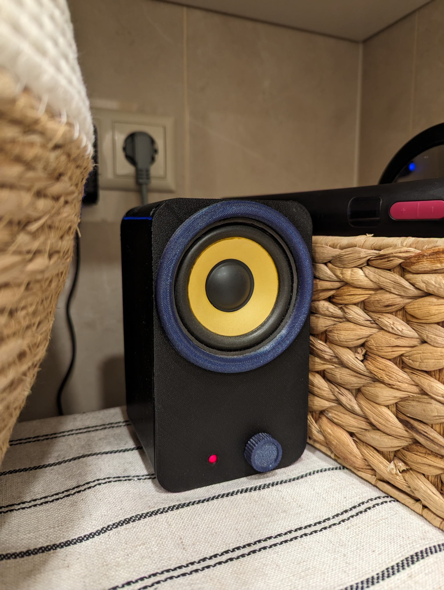

# The one and only WC internet radio

Runs on a Pi Zero W through I2S.

# How to

- `sudo apt-get update`
- `sudo apt-get install pigpio`
- `npm i`
- `sudo apt-get install -y mpg123`
- `sudo npm start`
- `/etc/systemd/system/ateja.service`

# Node

- `use nvm to install node`
- `sudo ln -s $(which node) /usr/bin/node`
- `sudo ln -s $(which npm) /usr/local/bin/npm`

# A few commands to run

`raspi-gpio set 20 pu`
`raspi-gpio set 4 pu`

https://raspberrypi-guide.github.io/programming/run-script-on-boot#editing-rclocal

# /boot/config.txt

# Systemd

- `sudo systemctl daemon-reload`
- `sudo systemctl start ateja`
- `journalctl -u ateja.service -f`
- `sudo systemctl status ateja`
- `sudo systemctl stop ateja`
- `sudo systemctl restart ateja`
- `sudo systemctl enable ateja`
- `sudo systemctl disable ateja`
