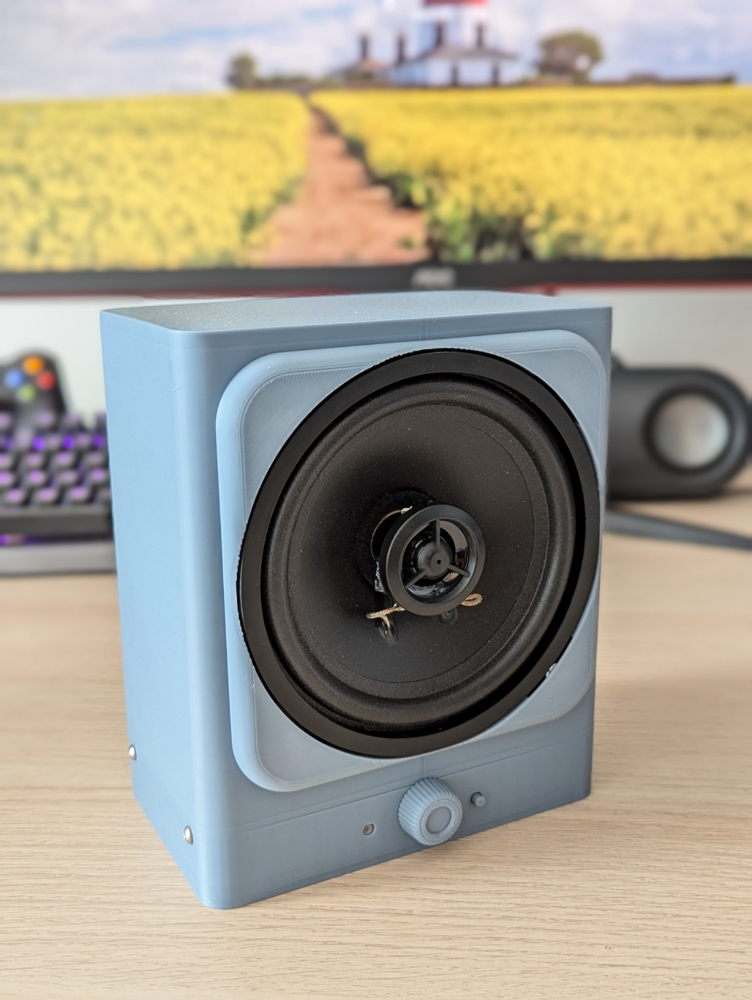

# WC internet radio

Inspired by a restroom that welcomed me as I entered, played smooth jazz while I was inside, and even said goodbye as I left. A Raspberry Pi Zero W at the heart.

All audio playback is based on [this Adafruit article](https://learn.adafruit.com/adafruit-max98357-i2s-class-d-mono-amp/raspberry-pi-wiring).

Legacy 32-bit Pi OS is required for this to work.

## V1

Turns out using a sonar distance sensor for presence detection does not work very well. You might enter the room and stay out of range for a bit, thus triggering a leave. Then after a bit re-trigger it. Many edge cases, for proper operation switch should be on the door and the door must be auto-closing. Otherwise the user experience will be flawed.

Kept the sonar as the on/off switch. Made to just work without spending much time on the looks.

Consists of a Pi Zero W, MAX98357 and a HC-SR04. Everything is powored from the Pi. Suprisingly, sounds better than most laptops.

## V2

While the V1 worked well, it did not look the part. Also the sonar was a gimmick and it lacked physical volume controls that turned out more important than anticipated.

The sonar was replaced with a switch and a rotary encoder entered the fray. Turn it on/off with the switch and adjust the volume with the ring around the speaker.

Worked well enough, but it sounded worse. Propably because the speaker was not as enclosed as it was previsouly. The ring was also flimsy feeling. For some reason I used a rotary encoder from a mouse. Which is tiny and made positioning it harder. Also bearings would have been nice.

## V3

Time to make it louder and make it look even nicer. Made possible by a bunch of interconencted modules: 12V power to an Aliexpress amplifirer. Buck/boost module to step down 12V to 5V for the Pi. An PCM5102A module for turning the Pi's I2S signal into analogue audio. Non removable 12V power brick.

Operation requires pressing a button to turn on audio playback from the Pi and turning nob to turn off the amp and perform volume control.

Sounds better and overall is much more pleasing to the eye.

## V4

The final iteration: getting rid of the rats nest of modules and making an integrated PCB for all. About 1.5 years of learning electronics made it possible.

It works better as ever and propably is the final form.

Is it perfect? Hell no, but functional without major flaws as far as I know. The PCB layouts ignore `recomended layouts` from the datasheets so to be easier to hand solder.

The speaker size really should be placed into a wooded enclosure. Also the [stream](https://fmstream.org/) quality is a factor now.

# How to

- `sudo apt-get update`
- `npm i`
- `sudo apt-get install -y mpg123`
- `sudo npm start`
- `/etc/systemd/system/ateja.service`

# Node

- `use nvm to install node`
- `sudo ln -s $(which node) /usr/bin/node`
- `sudo ln -s $(which npm) /usr/local/bin/npm`

# A few commands to add to /boot/config.txt

`raspi-gpio set 20 pu`
`raspi-gpio set 4 pu`

# Systemd

- `sudo systemctl daemon-reload`
- `sudo systemctl start ateja`
- `journalctl -u ateja.service -f`
- `sudo systemctl status ateja`
- `sudo systemctl stop ateja`
- `sudo systemctl restart ateja`
- `sudo systemctl enable ateja`
- `sudo systemctl disable ateja`
